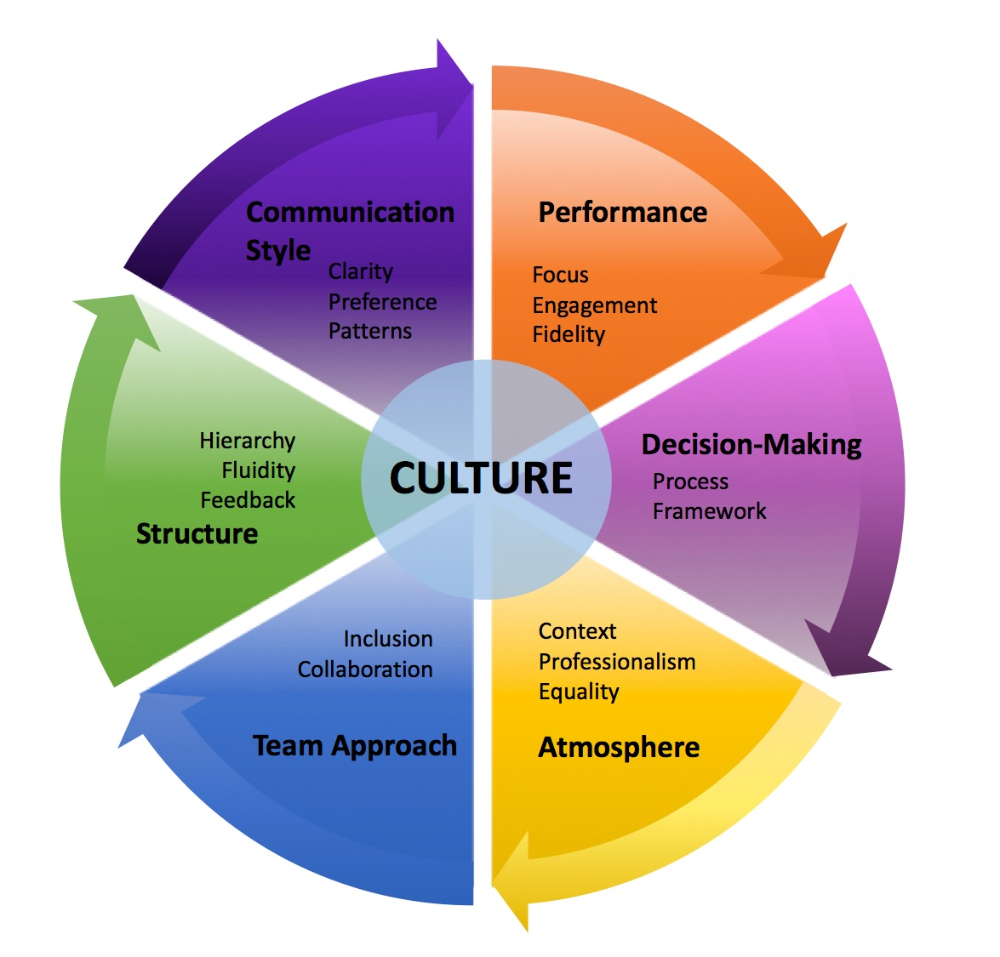

## Measuring Organizational Culture

Martin Hummel

2023-03-01

---

## What?

An organization's culture defines the proper way to behave within the organization.

Shared beliefs and values

Reinforced through various methods

Shaping employee perceptions, behaviors and understanding

---

## Why?

Measurement informs better decision making

Measurement builds stronger cultures

Better decisions and stronger cultures increase performance

---

## How?

## 
sources: https://www.surpassyourgoals.com/2018/05/6-elements-to-assess-your-companys-culture/
---

Thank You
